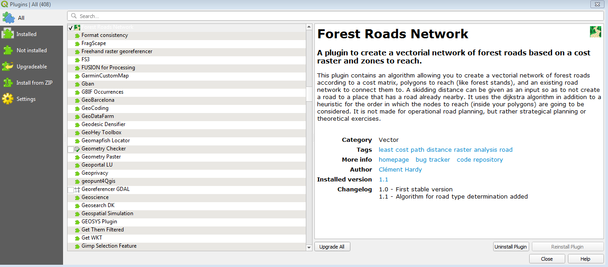
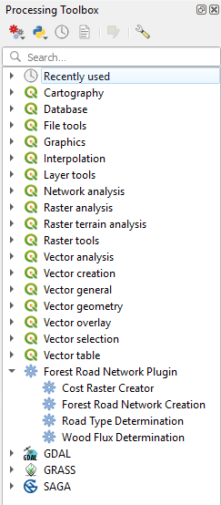
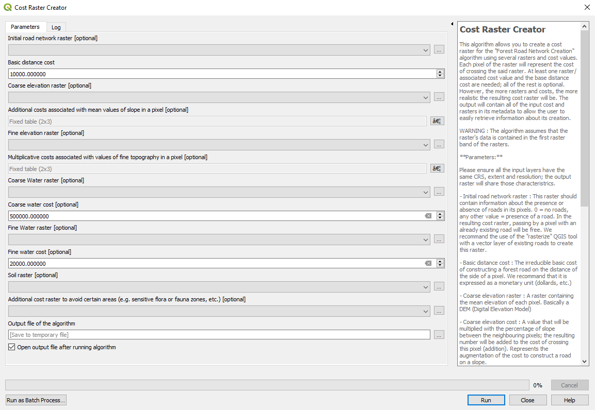
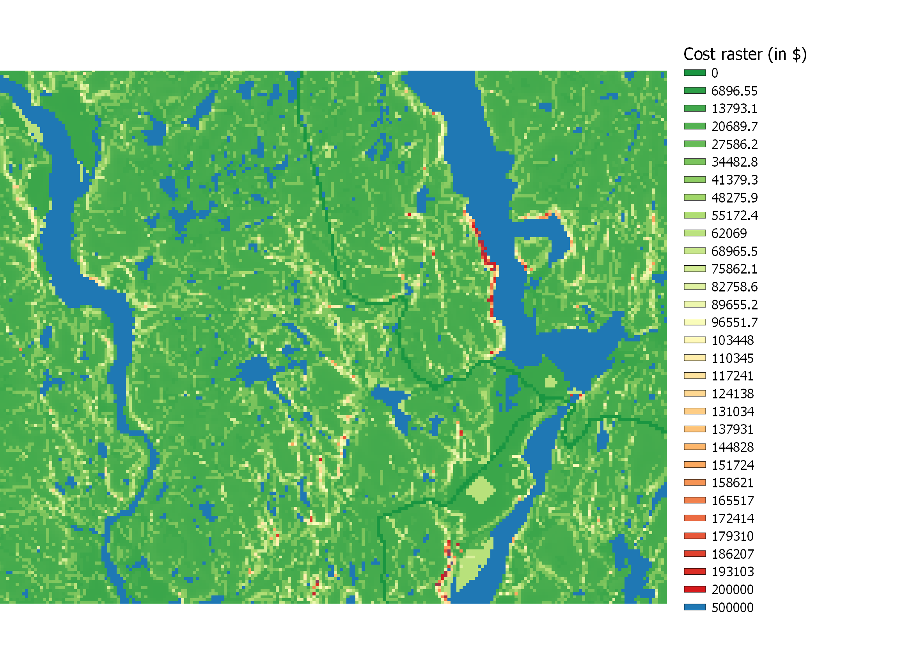
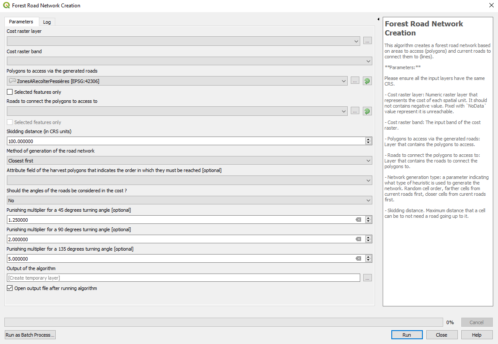
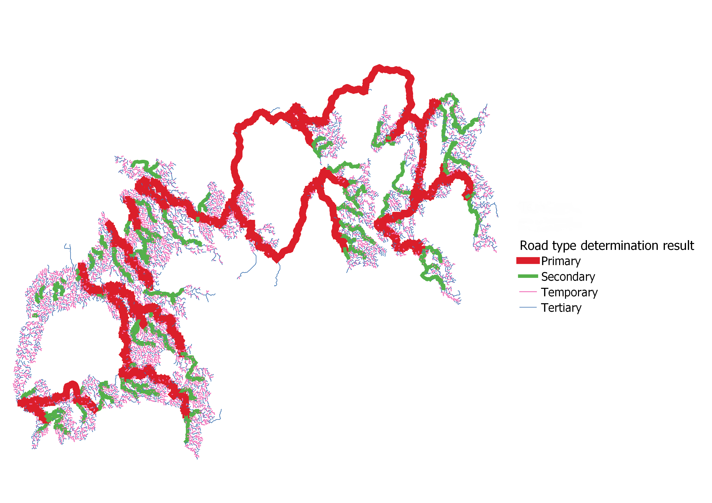

# The Forest Road Network Plugin for QGIS

This plugin contains several algorithms destined to help the user create an optimized forest road network.

## Features

- An algorithm to help the user to create a cost raster that is used afterward to compute the path of the forest road network
- An algorithm that creates the path of the forest road network in space
- An algorithm that determine how the wood will flow through the created forest road network
- An algorithm that will determine the type of each forest road (primary, secondary, tertiary, temporary/winter roads, etc.) according to the wood flux data

## Download and use

The plugin is currently accessible through the plugin repository of QGIS. You can download it by looking into the repository directly in QGIS, or download it through the following page : https://plugins.qgis.org/plugins/ForestRoadsNetworksUPLOAD/

To use the plugin, simply choose the algorithm you need to use in the QGIS processing toolbox. It is recommended to first create a cost raster; then, a forest road network; then to generate the flux of wood; and finally, to determine the road types.

## The "Cost Raster Creator" algorithm

This algorithm creates a cost raster based on 6 different rasters, and 5 different associated parameters. Only one raster and one parameter are obligatory; the others are optional.

The rasters are :

- A raster containing information about existing roads (0 = no road, anything else = existing road)
- A raster containing additional cost related to soils, compared to the basic "reference" cost of construction of a road on a pixel (see parameters)
- A raster containing elevation data
- A raster containing information about fine topographic element, such as contour lines (e.g. number or length of contour lines in a pixel)
- A raster containing information about bodies of water (lake, rivers) onto which a bridge is necessary (0 = no water, anything else = body of water in the pixel)
- A raster containing information about streams crossing the pixel (e.g. number or length of streams in the pixel)
- An additional raster that can contain any remaining cost (e.g. costs due to particular legislations, or to avoid particular fauna habitats)

Only one of these rasters is needed to launch the algorithm.

The parameters are :

- The basic distance cost of building a forest road of the smallest type on a flat terrain and with the best type of soil for road construction, on the length of a pixel
- The "slope" table of parameter that will associate ranges of slope to an additional cost
- The "fine topography threshold" table of parameter, which will associate ranges of values of fine topography to a multiplicator that will represent a detour that will have to be made while crossing the pixel
- The "bridge" parameter, which correspond to the mean cost of constructing a bridge on a body of water the size of a pixel
- The "culvert" parameter, which is the mean cost of construction a culvert on a stream

Only the basic distance cost parameter is needed to launch the algorithm. Additional costs due to the slope or to soils can be estimated easily by a simple linear model based on real cost data of constructed roads; with the correct reference levels put into the intercept of the model, the intercept of the model will become the basic distance cost.

We advise that the parameters and the cost rasters are all expressed in monetary units (such as dollards or euros) in order to facilitate parametrisation, and to better interpret the results of the Forest Road Network Creation algorithm (see below) if the cost raster produced by this algorithm is used for it.
 
**Interface of the "Cost Raster Creator" algorithm**

**Example of result from the "Cost Raster Creator" algorithm**

## The "Forest Road Network Creation" algorithm

This algorithm uses a cost raster that indicate the cost of building a forest road on a given pixel; polygons that represent harvested areas; lines that represent the main road network to which the forest road network must ultimately connect to; and a heuristic that determine in which order the roads are created by the algorithm. It can also take into account the angle of travel from one pixel to another to avoid sharp turns; but this function is still experimental.

The use of a heuristic to cut the MTAP (Multiple Target Access Problem) that represents the creation of an optimized forest road network into a set of STAP (Single Target Access Problem) that are dealt with in the given order of the heuristic is a method currently used by professional softwares such as REMSOFT Road Optimizer. However, I do not consider this plugin to be made for operational planning of forest road networks; it is rather made for strategical planning of theoretical exercises. 
 
**Interface of the "Forest Road Network Creation" algorithm**

**Example of result from the "Forest Road Network Creation" algorithm**

## The "Wood Flux Determination" algorithm

This algorithm use the previously created forest road network, the polygons where the wood was/will be harvested, and the end points of the network (where it connects with the main road network). 

Using a hydrological approach coupled with the calculation of the least-cost path from any road segment to the end points of the network, the flux is then created from the harvested area, and "fluxed" down the network until all arbitrary units of wood have reach and end point of the network.

To determine from where the wood comes from, and to where it will go from it source, the algorithm creates "source points" in the harvested polygons according to a point density given by the user. However, the algorithm will adapt to put at least one point in each polygon if the density given is too low for the size of a single polygon.
 
**Interface of the "Wood Flux Determination" algorithm**

**Example of result from the "Wood Flux Determination" algorithm**

## The "Road Type Determination" algorithm

This algorithm use the previously created forest road network where the wood flux are calculated, and optionally polygons to determine zones where temporary roads should be built as much as possible.

The user must also indicate thresholds of wood flux to select the right road type for each forest road; and optionally, a certain type of road that can be accommodated as temporary roads. If so, a percentage of length of this type of road to convert to temporary roads must also be given.

**Interface of the "Road Type Determination" algorithm**

**Example of result from the "Road Type Determination" algorithm**

## Author

[Clément Hardy - PhD Student at the Université du Québec à Montréal](http://www.cef-cfr.ca/index.php?n=Membres.ClementHardy)

Mail : clem.hardy@outlook.fr

The work that allowed the creation of this module was fonded by the [Ministry of Forests, Fauna and Parcs of Québec](https://mffp.gouv.qc.ca/)

## Acknowledgments

The basis for the code have been shamelessly taken from the work available on this repository : https://github.com/Gooong/LeastCostPath
A big thanks to their team for creating such a clean code that allowed me to gain a lot of time.

Another big thanks to the [Ministry of Forests, Fauna and Parcs of Québec](https://mffp.gouv.qc.ca/) for allowing me to work on this interesting subject.
